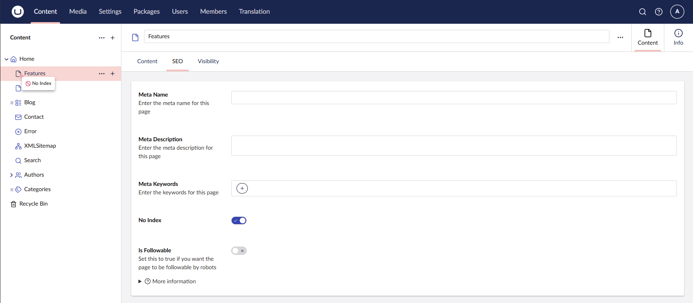
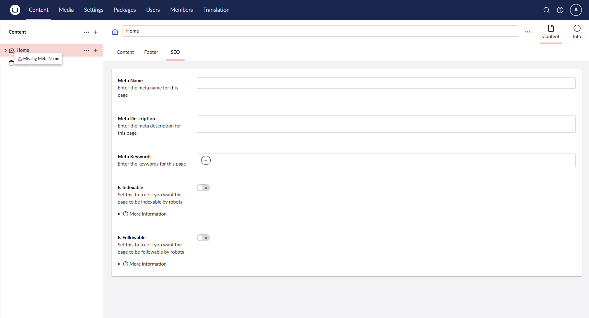

# Easy Entity Flags

Easy Entity Flags is an Umbraco package that lets you display configurable icon flags on content tree items, collection items, and document items using only `appsettings.json`.


[](https://www.nuget.org/packages/EasyEntityFlags)
[](https://marketplace.umbraco.com/package/easyentityflags)

## Configuration

Add an `EasyEntityFlags` section to your `appsettings.json`:

```json
{
  "EasyEntityFlags": {
    "EntityFlags": [
      {
        "Label": "No Index",
        "PropertyAlias": "noIndex",
        "Icon": "icon-badge-remove",
        "IconColorAlias": "red"
      }
    ]
  }
}
```

### Flag properties

| Property | Required | Description |
|---|---|---|
| `PropertyAlias` | Yes | The alias of the content property to evaluate |
| `Icon` | Yes | Umbraco icon code (e.g. `icon-badge-remove`) |
| `Label` | Yes | Tooltip label shown in the backoffice. Supports Umbraco localization keys prefixed with `#` (e.g. `#general_name`) — [see all keys](https://github.com/umbraco/Umbraco-CMS/blob/main/src/Umbraco.Web.UI.Client/src/assets/lang/en.ts) |
| `Condition` | No | When to show the flag — see below (default: `IsTrue`) |
| `IconColorAlias` | No | Color alias (e.g. `red`, `orange`, `green`) |
| `ForEntityTypes` | No | Entity types to apply the flag to (default: `["document"]`) |

### Conditions

| Value | Shows flag when… |
|---|---|
| `IsTrue` | The property is a boolean and is `true` *(default)* |
| `IsFalse` | The property is a boolean and is `false` |
| `HasValue` | The property has a value |
| `HasNoValue` | The property has no value (field is empty) |

#### Examples

Flag content that is missing an SEO title:

```json
{
  "Label": "Missing SEO title",
  "PropertyAlias": "metaTitle",
  "Icon": "icon-badge-remove",
  "IconColorAlias": "red",
  "Condition": "HasNoValue"
}
```

Flag content where `noIndex` is turned on:

```json
{
  "Label": "No Index",
  "PropertyAlias": "noIndex",
  "Icon": "icon-eye-close",
  "IconColorAlias": "red",
  "Condition": "IsTrue"
}
```

Flag content where an `isIndexable` toggle is turned **off** (inverted boolean):

```json
{
  "Label": "Not indexable",
  "PropertyAlias": "isIndexable",
  "Icon": "icon-eye-close",
  "IconColorAlias": "red",
  "Condition": "IsFalse"
}
```

## Screenshots

### No Index


### Missing Meta Name

